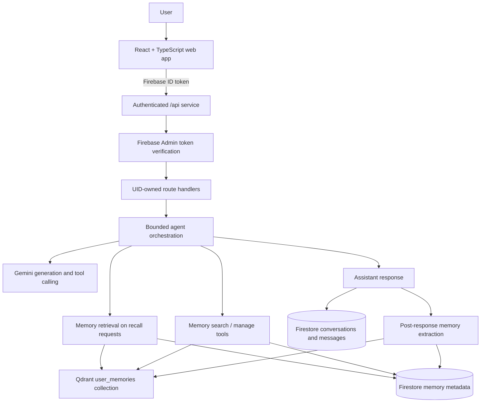

# Adaptive AI Agent

Adaptive is a personal AI workspace that makes conversations more useful over
time. It combines persistent conversations, explicit long-term memory, semantic
retrieval, Gemini-powered responses, server-side agent tools, and feedback-based
response adaptation without retraining a model.

It is designed as a small, explainable full-stack system rather than a generic
chat clone: the user owns the context that carries forward, and the application
keeps memory visible and editable.

## Features

- Firebase email/password authentication with protected workspace routes
- Firestore-backed, user-owned conversations and messages
- Gemini response generation through the server
- Conservative memory extraction after successful chat interactions
- Google Gemini embeddings for semantic memory search
- Qdrant vector storage with Firebase UID ownership filtering
- Bounded server-side Gemini function calling for memory search and management
- Feedback-based application adaptation for response style
- Memory dashboard for viewing, editing, and deleting saved memories
- Responsive React interface with desktop navigation and mobile navigation
- Input validation, safe error responses, CORS restrictions, rate limiting, and
  prompt-injection boundaries

## Architecture



The frontend uses Firebase Authentication in the browser and sends the current
Firebase ID token as a bearer token through the generated API client. The API
verifies that token with Firebase Admin, derives ownership from the verified
UID, and performs server-side Firestore, Gemini, and Qdrant operations.

## Tech stack

- pnpm workspace and Node.js 24
- TypeScript 5.9
- React, Vite, Tailwind CSS, Wouter, and TanStack Query
- Firebase Authentication and Cloud Firestore
- Express 5 and Firebase Admin
- Official Google Gemini SDK
- Official Qdrant REST client plus server-side Qdrant search
- OpenAPI, Orval-generated React Query hooks, and generated Zod schemas
- esbuild for the API bundle

## Repository layout

- `artifacts/adaptive-ai-agent/` — React/Vite web application
- `artifacts/api-server/` — Express API service
- `lib/api-spec/openapi.yaml` — API contract source of truth
- `lib/api-client-react/` — generated React Query client
- `lib/api-zod/` — generated server-side Zod schemas
- `docs/ARCHITECTURE.md` — implementation architecture and data flow
- `docs/DEMO.md` — short demonstration flow
- `.env.example` — safe environment-variable reference

## Local development

Install dependencies with pnpm:

```bash
pnpm install
```

Configure the variables in `.env.example` through the workspace environment
before starting the services. Run the API and web services in separate
workflows or terminals:

```bash
pnpm --filter @workspace/api-server run dev
pnpm --filter @workspace/adaptive-ai-agent run dev
```

The artifact workflows provide the required `PORT` and `BASE_PATH` values.
The web app is served at `/` and the API is served under `/api`.

Useful repository commands:

```bash
pnpm run typecheck
PORT=23385 BASE_PATH=/ pnpm run build
pnpm --filter @workspace/api-spec run codegen
pnpm run check:phase9
PHASE9_BASE_URL=https://your-api-host pnpm run check:phase9
```

The frontend Vite configuration requires the same `PORT` and `BASE_PATH`
values that the artifact workflow injects. The explicit values above make a
shell production build reproducible; the workflow already supplies them.

Run API code generation after changing `lib/api-spec/openapi.yaml`, before
using the changed generated client or schemas.

## Environment setup

See `.env.example` for the complete variable list. Firebase browser
configuration uses the `VITE_FIREBASE_*` values and is safe to expose as
client configuration. Firebase Admin credentials, Gemini credentials, Qdrant
credentials, and server tuning values are server-only.

The frontend must never receive `GEMINI_API_KEY`, `QDRANT_API_KEY`,
`FIREBASE_PRIVATE_KEY`, or Firebase Admin client credentials. In Replit,
configure these values as Secrets rather than committing them to the
repository. `PORT`, `BASE_PATH`, and production `NODE_ENV` are supplied by
the artifact deployment configuration.

## Security

- API routes verify Firebase ID tokens, including revocation status.
- Ownership is derived from the verified Firebase UID, never from request
  bodies or model output.
- Conversation, message, memory, and feedback operations validate ownership
  before reading or mutating resources.
- Zod schemas bound text, IDs, enums, and request payloads.
- CORS is same-origin by default and accepts only explicit configured origins.
- Per-user request and concurrency limits protect assistant, memory, and
  feedback writes.
- Retrieved memories, tool results, and extraction input are delimited and
  treated as untrusted model-visible data.
- Provider failures return stable application errors without exposing raw
  provider details or credentials.

## Testing and verification

The following checks have been executed during Phases 1–10:

- Workspace, frontend, and API TypeScript checks
- Frontend, API, and full production builds
- `git diff --check`
- Static Phase 9 source-boundary checks
- Live unauthenticated, malformed-body, oversized-body, and CORS checks
- Disposable authenticated Firebase signup/login verification
- Authenticated Gemini chat generation and Firestore persistence
- Live embedding/Qdrant memory indexing and recall during chat
- Authenticated request and concurrency rate-limit checks
- Two-user ownership/IDOR checks for conversations, messages, memories, and
  feedback
- Revoked Firebase ID-token rejection
- SAST and privacy/dataflow scans

The authenticated verification used disposable accounts and cleaned up the
created users and test data afterward. Artificial Gemini/Qdrant outage
injection was **Not verified yet** because it would require changing runtime
service configuration.

## Deployment readiness

The current artifact configuration is already prepared for publishing:

- Root `.replit` selects the autoscale deployment target.
- The frontend production service builds a static bundle and rewrites routes
  to `index.html`.
- The API production service builds an esbuild bundle, runs the bundled
  server, and uses `/api/healthz` as its startup health check.
- Frontend and API services use the existing path-routed artifact setup.

Manual configuration required:

1. Add all client-safe `VITE_FIREBASE_*` values to the web build environment.
2. Add Firebase Admin credentials, `GEMINI_API_KEY`, `QDRANT_URL`, and
   `QDRANT_API_KEY` to the API runtime environment.
3. Enable Firebase email/password authentication and add the published
   domain to Firebase authorized domains.
4. Confirm the Qdrant collection can be created or accessed with the supplied
   credentials. The API creates the `user_memories` collection and its
   `userId` payload index when needed.
5. Set `CORS_ORIGINS` only if a separate trusted origin will call the API;
   same-origin frontend/API publishing does not require it.
6. Review the first-publish geography in the Publishing settings before
   publishing; Replit locks geography after the first publication.

This project has not been deployed automatically. Publishing is a user action.

## Limitations and future work

- The in-memory rate limiter is intentionally small and process-local; a
  horizontally distributed deployment would need a shared limiter later.
- Firestore ordered list queries have bounded application fallbacks when a
  declared composite index is unavailable.
- More provider-outage simulation and production observability could be added
  later without changing the current product behavior.
- Dependency audit advisories should be reviewed as compatible upstream
  versions become available; risky major upgrades were not forced.
